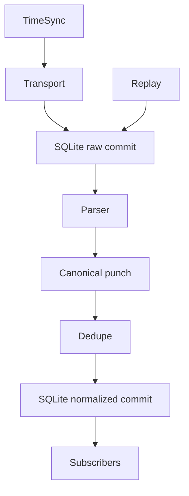

# M1 architecture

Only foxcore exists. FoxBridge and FoxLive are future consumers; serial, parsing, UID handling, dedupe, persistence and TimeSync belong here.

One asyncio loop owns SQLite and ingest. Serial open/read/write/close run through bounded blocking pyserial calls in worker threads for Windows support. Reader and writes are independent; writes are serialized. Connection changes drive a separate TimeSync task. SQLite writes never run in those threads. Raw commits use FULL synchronous WAL before processing; downstream exceptions leave recoverable raw records. Database failures propagate visibly and stop ingest rather than continue losing input. Bytes already outside the application (USB/OS buffers) cannot be guaranteed on power loss. Pending raw records are processed on startup; replay creates new records and a separate dedupe scope.

Subscribers are synchronous, short callbacks isolated by exception handling; slow consumers should enqueue their own work. They must not perform blocking I/O. Transport reconnect only handles I/O errors, never mistakes persistence errors for USB errors. Shutdown cancels time service, disconnects transport, flushes partial serial input and closes SQLite. No scoring, frontend, virtual COM, or SPORTident code is included.
