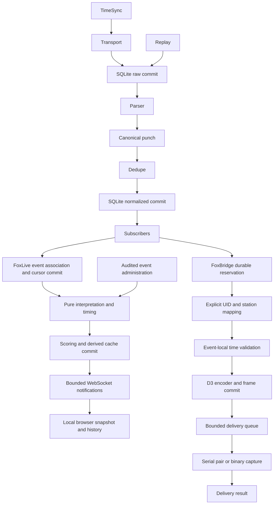

# FoxSuite architecture — M1, M2 and M3

`foxcore` owns serial, parsing, UID normalization, dedupe, persistence, replay and TimeSync.
`foxbridge` is an event consumer and SPORTident live-output gateway, not competition software.
M3 adds FoxLive as a sibling event consumer, with the domain contract in [FOXLIVE.md](FOXLIVE.md).
The shared CLI is the composition root; its command registration
does not make core event/parser/transport modules depend on bridge logic.

One asyncio loop owns SQLite and ingest. Serial open/read/write/close run through bounded blocking pyserial calls in worker threads for Windows support. Reader and writes are independent; writes are serialized. Connection changes drive a separate TimeSync task. SQLite writes never run in those threads. Raw commits use FULL synchronous WAL before processing; downstream exceptions leave recoverable raw records. Database failures propagate visibly and stop ingest rather than continue losing input. Bytes already outside the application (USB/OS buffers) cannot be guaranteed on power loss. Pending raw records are processed on startup; replay creates new records and a separate dedupe scope.

Subscribers are synchronous, short callbacks isolated by exception handling; slow consumers should
enqueue their own work. They must not perform blocking I/O. Transport reconnect only handles I/O
errors, never mistakes persistence errors for USB errors. Shutdown cancels time service, disconnects
transport, flushes partial serial input and closes SQLite. Competition interpretation is exclusively
FoxLive's responsibility, never a parser/serial/TimeSync policy.

## FoxBridge boundaries

Flat, small modules: `config`, `mapping`, `sportident`, `time`, `persistence`, `output`, `service`,
`cli`. Mapping is explicit and separate from FoxCore participant metadata. The encoder is a pure
typed bytes API with no database, serial or Fjw dependencies. Time conversion never changes the
original source timestamp. Serial output wraps the existing FoxCore serial mechanics; it does not
duplicate the FoxIdentServer reader/parser or TimeSync. No virtual COM driver is installed.

One bridge worker consumes a bounded queue (default 1024 IDs). Its subscriber commits mapping
snapshots, validated frame and offset allocation before enqueueing. Database operations remain on
the same loop/thread as FoxCore. Output writes use bounded pyserial worker calls; file capture
writes/fsync use a worker and wait for completion even on cancellation. Incoming serial and TimeSync
remain independent of a slow output, subject to brief serialized SQLite transactions. Queue overflow
records a failed delivery rather than dropping it invisibly. Mapping/encoding errors skip one punch,
not the stream. Delivery-ledger failures stop bridge operation visibly; FoxCore raw/punch data was
already committed. Logging remains protected by FoxCore's SafeLogger.

## Reservation and recovery

The durable automatic key is `(target, punch_id)`. Existing reservations, regardless of status,
prevent another automatic attempt. `queued → writing` is committed before external I/O. `sent`
means the local driver/file accepted the bytes, **not** FjwW acknowledgement. Failed connection is
`failed`; interrupted/possibly partial writes are `uncertain`. A crash can leave `queued` or `writing`.
None of those rows is automatically resumed. This prefers possible missed delivery requiring operator
action over uncontrolled competition duplicates; exactly-once receiver acceptance is impossible on
this unacknowledged stream.

Startup recovers pending FoxCore raw records **before** bridge subscription. It never scans historical
punches for delivery. New source retries are suppressed by unchanged FoxCore dedupe. Output reconnect
only admits new events; explicit `resend` creates a separate audited attempt and reuses any previously
encoded frame. Do not change `target` to bypass the ledger. One active bridge writer per DB/target is
the operational model; status reads and brief mapping commands can use separate SQLite connections.

Replay uses FoxCore's original path and provenance. Replayed punches are recorded as `replay_blocked`
unless an operator explicitly supplies `--allow-replay-output`; the guarded bridge replay command
does not even open the output endpoint. Explicit output replay can duplicate an event already in Fjw.

## FoxLive boundaries and lifecycle

`models` and `scoring` define typed domain inputs and pure deterministic rules; `persistence` reads
facts in bulk and supplies event-scoped repositories; `service` owns association, administration,
recalculation and audit; `csvio` supplies atomic registration import/export. `web` composes accepted
FoxCore transport/ingest/TimeSync and domain services; `cli` owns operations. `templates` and `static`
are local assets. No FoxLive module imports FoxBridge. The shared `foxcore.cli` is only the suite's
composition root, not a product dependency of the core services.

Uvicorn has one worker. FastAPI lifespan creates/owns SQLite on the asyncio loop thread; all routes
are async and invoke brief synchronous domain/database operations on that same thread. Do not use
sync routes/thread-pool DB access or multiple workers. Existing pyserial workers never access SQLite.
FoxLive does no independent reading/parsing. `--no-serial` allows administration and historical tests.
Core raw recovery precedes Live recovery/subscription; an existing RUNNING event then catches up
source IDs after its durable cursor. Starting/resuming sets a fresh cursor rather than backfilling
all history. Association is committed separately before interpretation: a derived-write failure leaves
both the core fact and its event relationship recoverable. Closing stops new automatic associations;
archiving makes normal administration read-only. DB-enforced uniqueness prevents overlapping events.

Live intake recalculates one UID's associated history, updates its cache, then ranks the event's cached
results in bulk. Configuration changes fully recompute affected event interpretation/results. Source
timestamp then source ID is the deterministic order, not arrival time. Audit and administrative writes
share transactions with the derived recalculation. Source rows are read-only to these operations.
No generic plugin bus, scoring in routes, Redis or cross-process coordination is introduced.

WebSocket clients have bounded 128-message queues. Overflow emits `resync`; a blocked sender times
out without stopping ingest or other clients. The browser fetches an authoritative snapshot after
notifications/reconnect; open participant detail refreshes too. UI running clocks are provisional,
not persisted sporting results. HTTP host/origin checks, JSON-only mutations, autoescaping and local
assets constrain common browser hazards, but there is no network authentication/RBAC.
FastAPI native telemetry and automatic environment exporter setup are explicitly disabled. The
transitive OpenTelemetry API has no enabled instrumentation/exporter; runtime does not send telemetry.

Expected validation errors are concise HTTP 422/CLI ERROR messages. Persistence errors return 503;
a source/derived ingest failure latches visible health and stops the serial task instead of pretending
successful ongoing scoring. Repair disk/permissions then restart/recover. Ingest isolates normal
unknown tags/stations as interpretations, not exceptions. SafeLogger protects ingest from log handlers.
Large operator-triggered recalculation/import is synchronous and may briefly pause desk updates;
this is deliberately a small single-operator event desk, not a multi-user/distributed service.
See [FOXLIVE](FOXLIVE.md) for timing, tie, correction and restart contracts. Full SPORTident readout,
station programming, complete Fjw replacement and all later milestones remain out of scope.
