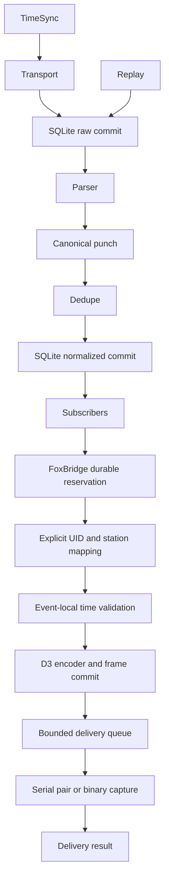

# FoxSuite architecture — M1 and M2

`foxcore` owns serial, parsing, UID normalization, dedupe, persistence, replay and TimeSync.
`foxbridge` is an event consumer and SPORTident live-output gateway, not competition software.
FoxLive remains unimplemented. The shared CLI is the composition root; its command registration
does not make core event/parser/transport modules depend on bridge logic.

One asyncio loop owns SQLite and ingest. Serial open/read/write/close run through bounded blocking pyserial calls in worker threads for Windows support. Reader and writes are independent; writes are serialized. Connection changes drive a separate TimeSync task. SQLite writes never run in those threads. Raw commits use FULL synchronous WAL before processing; downstream exceptions leave recoverable raw records. Database failures propagate visibly and stop ingest rather than continue losing input. Bytes already outside the application (USB/OS buffers) cannot be guaranteed on power loss. Pending raw records are processed on startup; replay creates new records and a separate dedupe scope.

Subscribers are synchronous, short callbacks isolated by exception handling; slow consumers should
enqueue their own work. They must not perform blocking I/O. Transport reconnect only handles I/O
errors, never mistakes persistence errors for USB errors. Shutdown cancels time service, disconnects
transport, flushes partial serial input and closes SQLite. No scoring or frontend exists.

## FoxBridge boundaries

Flat, small modules: `config`, `mapping`, `sportident`, `time`, `persistence`, `output`, `service`,
`cli`. Mapping is explicit and separate from FoxCore participant metadata. The encoder is a pure
typed bytes API with no database, serial or Fjw dependencies. Time conversion never changes the
original source timestamp. Serial output wraps the existing FoxCore serial mechanics; it does not
duplicate the FoxIdentServer reader/parser or TimeSync. No virtual COM driver is installed.

One bridge worker consumes a bounded queue (default 1024 IDs). Its subscriber commits mapping
snapshots, validated frame and offset allocation before enqueueing. Database operations remain on
the same loop/thread as FoxCore. Output writes use bounded pyserial worker calls; file capture
writes/fsync use a worker and wait for completion even on cancellation. Incoming serial and TimeSync
remain independent of a slow output, subject to brief serialized SQLite transactions. Queue overflow
records a failed delivery rather than dropping it invisibly. Mapping/encoding errors skip one punch,
not the stream. Delivery-ledger failures stop bridge operation visibly; FoxCore raw/punch data was
already committed. Logging remains protected by FoxCore's SafeLogger.

## Reservation and recovery

The durable automatic key is `(target, punch_id)`. Existing reservations, regardless of status,
prevent another automatic attempt. `queued → writing` is committed before external I/O. `sent`
means the local driver/file accepted the bytes, **not** FjwW acknowledgement. Failed connection is
`failed`; interrupted/possibly partial writes are `uncertain`. A crash can leave `queued` or `writing`.
None of those rows is automatically resumed. This prefers possible missed delivery requiring operator
action over uncontrolled competition duplicates; exactly-once receiver acceptance is impossible on
this unacknowledged stream.

Startup recovers pending FoxCore raw records **before** bridge subscription. It never scans historical
punches for delivery. New source retries are suppressed by unchanged FoxCore dedupe. Output reconnect
only admits new events; explicit `resend` creates a separate audited attempt and reuses any previously
encoded frame. Do not change `target` to bypass the ledger. One active bridge writer per DB/target is
the operational model; status reads and brief mapping commands can use separate SQLite connections.

Replay uses FoxCore's original path and provenance. Replayed punches are recorded as `replay_blocked`
unless an operator explicitly supplies `--allow-replay-output`; the guarded bridge replay command
does not even open the output endpoint. Explicit output replay can duplicate an event already in Fjw.

Future FoxLive must consume core events and reuse its infrastructure. Full SPORTident readout,
station programming, Fjw competition logic and all M3 functionality are outside this implementation.
