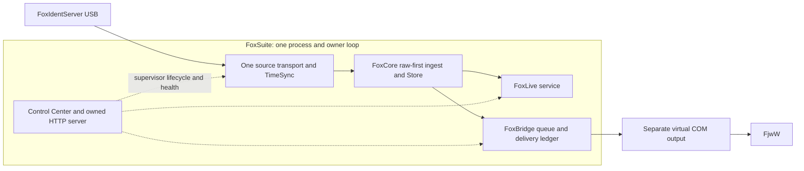

# M4.1 — FoxSuite Control Center and runtime supervisor

## Composition inspected before refactoring

Baseline: `dcd1ecb` (M5 ARDF BEACON correction). M6 visual redesign has not started.
The working tree also contains the Python discovery/build-dependency correction; M4.1 preserves it.

The installed `FoxSuite.exe` executes `packaging/windows/desktop.py`, which calls
`foxops.launcher.main`. The launcher takes the existing per-user OS file lock, writes the local
HTTP endpoint to `running.json`, and runs one Uvicorn server inside its asyncio loop. Reopening
the shortcut opens the existing endpoint. There are no FoxLive/FoxBridge child processes in
this composition. The optional frozen `foxsuite-cli.exe` remains a separate, explicit developer tool.

`foxops.web.create_app` extends the FoxLive FastAPI app and wraps its lifespan. The underlying
`foxlive.web` lifespan opens one `Store`, creates one `IngestService`, `LiveRepository`, `LiveService`
and browser `Hub`, recovers existing facts, and subscribes `LiveService.accept` to canonical punches.
Desktop operations disable the underlying app's serial startup and instead manage their own
`foxlive.web.source` task. That task constructs one `SerialTransport` and `TimeSyncService`.
Serial reads/writes use bounded thread work; SQLite and event callbacks run on the owner loop.
The transport reconnects, assembles complete lines and retains partial bytes at disconnect/shutdown.

`IngestService.ingest` commits the raw record before parsing/normalizing. `Store.finish` commits
processing/canonical-punch results, including source-based duplicate information, before synchronous
subscriber dispatch. Subscriber exceptions are isolated. FoxLive associates source facts and derives
results without replacing FoxCore persistence. The Hub fans out UI notifications with bounded queues
and a resync mechanism. Source/TimeSync diagnostics are already persisted in the shared database.

The first-run wizard and settings page use `foxops.web.Controller`, immutable `Settings`, atomic
TOML saves and EN/DE catalogs. USB VID/PID/serial metadata gates unexpected port relocation.
A connection test cancels/awaits the normal reader before opening a temporary bounded probe; probe
bytes go through the same ingest/store. Configuration changes restart the reader. Port/data/restore
changes queue a launcher action that runs after lifespan shutdown closes serial and SQLite.
Backups use SQLite's backup API and validated, flushed archives. Explicit TOML overrides are read-only
in the graphical settings. After setup, `/` currently renders the FoxLive desk, rather than a suite
operational landing page.

FoxBridge's existing CLI constructs `BridgeService` and subscribes it to an `IngestService`, then
runs the existing FoxCore serial coordinator. The installed desktop does not construct FoxBridge,
and desktop `Settings` do not currently load/save its configuration. `BridgeService` has a bounded
queue and durable delivery reservations, explicit UID/station maps, replay protection and at-most-once
delivery behavior. `SerialOutput` uses the existing serial transport mechanics for a distinct virtual
output COM port; `validate_output` rejects input/output aliases, including Windows device prefixes.
Interrupted writes retain uncertain delivery evidence; restart does not automatically resend history.

Existing desktop shutdown asks Uvicorn to exit, cancels/awaits the source task, stops TimeSync,
disconnects serial and closes the store. Browser closure alone does not stop the server. Error/status
visibility is mainly FoxLive-oriented and does not supervise a desktop Bridge worker. The Inno Setup
shortcut and installer already identify the product as FoxSuite and preserve per-user data.

## M4.1 implementation direction

Keep one OS process, one asyncio owner loop, one source transport, one raw-first ingest/store and
one local HTTP server. Introduce a small `FoxSuiteRuntime` composition root that coordinates the
existing FoxLive runtime, the source/TimeSync lifecycle and optional FoxBridge subscription/worker.
Make `/` the FoxSuite Control Center and keep the existing desk at `/live`. Reuse the existing
wizard, settings, backups, identity checks, single-instance lock and controlled server restarts.
No new GUI toolkit, independent parser, serial reader per module or hidden background process is
needed.

## Resulting composition

`foxops.runtime.FoxSuiteRuntime` is the installed application's composition root. On the owning
lifespan loop it uses the extracted existing `foxlive.web.create_runtime` constructor for the one
Store/IngestService/LiveService/Hub. The HTTP app accepts that externally owned runtime; its ordinary
standalone CLI lifespan still constructs/closes its own runtime. Desktop startup does not invoke
the standalone FoxLive or Bridge CLI runners. The desktop supervisor starts Bridge's canonical
subscription before admitting new source data. Raw recovery precedes Bridge subscription and never
backfills its queue. No database migration, duplicate parser or event-dispatch system was added.

FoxLive recovery failures are retained as module health errors in the desktop composition rather
than preventing the Control Center, FoxCore reader or Bridge from starting. The standalone FoxLive
CLI preserves its existing fail-on-startup recovery behavior. Control Center status also isolates
failure to read FoxLive's current event from infrastructure/Bridge status.

The supervisor constructs the source transport and reuses the existing `foxlive.web.source`
coordinator for TimeSync, diagnostics and raw-first ingest. It owns and awaits the source task.
Connection probes use its temporary replacement transport only after the ordinary reader has
closed, and resume the ordinary source after the existing USB identity check. Controller's existing
async lock serializes operator mutations/probes. The same input/output alias validator guards
Bridge configuration, startup and connection probes. Changing only Bridge settings does not reopen
the hardware reader.

Bridge reuses `BridgeService`, `DeliveryRepository`, existing output implementations and mappings.
Stop unsubscribes first, cancels/awaits the worker/output and marks remaining current queue items
failed; interrupted writes retain uncertain evidence. Fatal worker failure unsubscribes Bridge and
is shown separately from source/FoxLive health. Source persistence failure stops the source reader
and is visible in the Control Center, without labelling the still available desk as a failed module.
One shared database remains accessible for diagnostics and deliberate recovery controls.

`Settings` now loads/saves the existing `[bridge]`, `[bridge.output]` and `[bridge.sportident]` models,
including configured bounds and absolute desktop capture paths. GUI mapping operations call the
existing MappingRepository. Ordinary Start/Stop saves the desired startup state atomically; override
mode permits temporary module lifecycle controls without modifying either configuration file.
The original wizard finishes at `/`; `/live` remains the accepted desk and links back to FoxSuite.
Control Center assets reuse local browser infrastructure, existing CSS and EN/DE catalog conventions.

The launcher continues to own Uvicorn/socket/OS lock and the pending-action restart loop. Restart
requests exit the current server, await supervisor shutdown and close SQLite before recreating the
runtime in the same PID. Restore/data changes retain their existing post-shutdown ordering. Exit
ends that loop and releases the lock/endpoint marker. No child process is introduced; serial worker
threads are awaited by the accepted transport/output cancellation handling. Closing a browser alone
does not stop reception. Developer CLI instances remain explicit tools and must not be run alongside
the installed runtime against the same input port.

## Validation

Software validation on Linux, using the final implementation:

- Python 3.12 full suite: **392 passed**, with browser tests enabled and no skips. This includes
  all 20 Chromium workflows and 12 PowerShell build-bootstrap regression cases.
- Python 3.13 runtime/operations/FoxLive regression checks: **58 passed**.
- Ruff lint/format, strict mypy for Linux and Windows platform targets, JavaScript syntax checks
  and `git diff --check`: passed. One existing upstream Starlette TestClient warning remains.
- Fresh sdist/wheel and Linux frozen desktop/CLI builds: passed. The installed wheel and frozen
  applications both passed the extended smoke: Control Center/offline assets, actual desktop PID,
  Bridge output closure/start/stop, same-process runtime restart, no historical resend,
  HTTP/WebSockets, M5 BEACON recovery, backup/restore, data copy and clean exit/relaunch.
- Runtime regressions exercise one reader across probes/reconnects, exactly-once shared ingest
  and canonical fan-out, input/output aliases, persistent Bridge settings/mappings, module failure
  isolation and interrupted/queued delivery shutdown evidence.

Native Windows installer/USB/virtual-COM/FjwW acceptance remains pending; simulated and Linux checks
do not establish physical acceptance. On the Windows acceptance machine, verify that the installed
shortcut opens the Control Center, a hardware punch reaches both modules through one source owner,
Bridge uses a distinct virtual output COM port, unplug/reconnect and TimeSync status are visible,
Bridge stop/start leaves hardware reception active, and restart/exit release the owned ports and
server without orphan processes. Reopening the shortcut must reuse the running instance.

M1–M5 domain behavior and the ARDF BEACON correction remain in place. M6 has not started.
