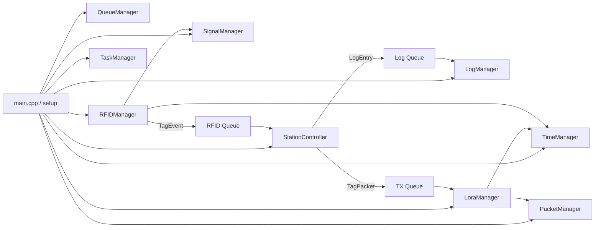
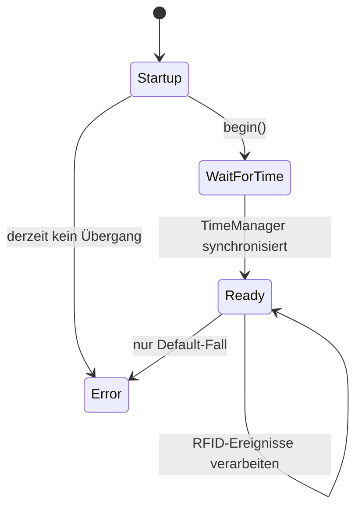
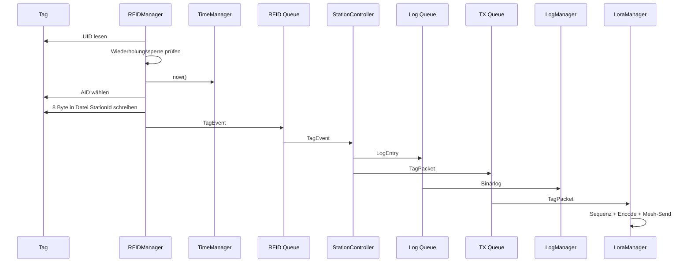
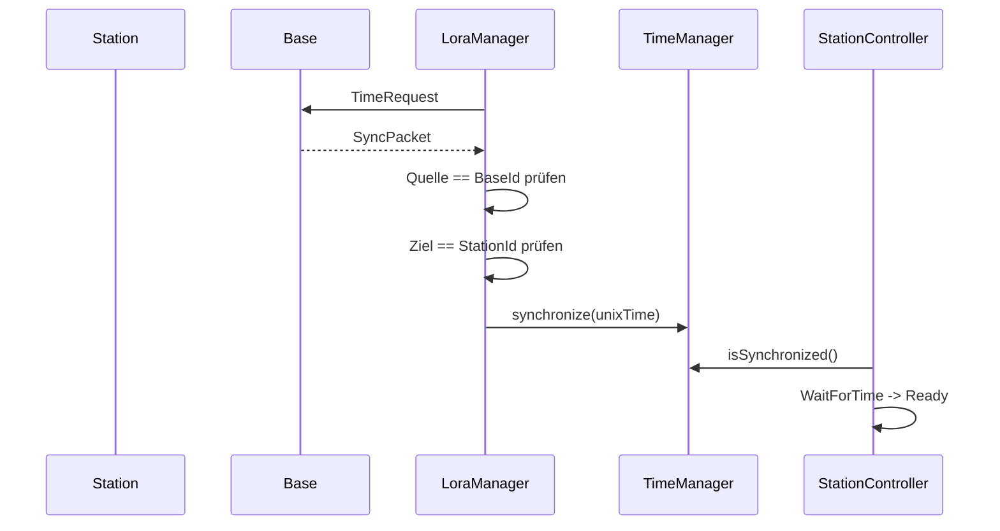

# FoxIdent V1.0.0 – LLM-Dokumentationssatz

Diese Dateien beschreiben den analysierten, lauffähigen Projektstand kompakt genug für lokale Coding-LLMs.

## Empfohlene Lade-Reihenfolge

1. `00_PROJECT.md`
2. `01_ARCHITECTURE.md`
3. `02_HARDWARE.md`
4. `03_TASKS_AND_QUEUES.md`
5. `04_DATA_FLOW.md`
6. `05_PROTOCOLS_AND_FORMATS.md`
7. `06_COMPONENT_API.md`
8. `07_BUILD_AND_CONFIG.md`
9. `ARCHITECTURE_FREEZE.md`
10. `LLM_INSTRUCTIONS.md`

Für Änderungen zusätzlich laden:

- `08_EXTENSION_GUIDE.md`
- `09_KNOWN_LIMITS.md`
- `10_SOURCE_MAP.md`

## Geltungsbereich

Dokumentiert wurden:

- `platformio.ini`
- `include/*.h`
- `src/*.cpp`

Nicht als Projektarchitektur dokumentiert wurden:

- unveränderte Fremdbibliotheken unter `lib/`
- Dateien unter `src/samples/`, da sie durch `build_src_filter` ausgeschlossen sind

## Wichtiger Hinweis

Die Dokumentation beschreibt den **Ist-Stand V1.0.0**. Vorbereitete, aber noch nicht vollständig implementierte Funktionen sind ausdrücklich als solche markiert.


---

# 00 – Projektüberblick

## Zweck

FoxIdent ist eine ESP32-S3-Feldstation für RFID-basierte Zeit- und Stationsregistrierung.

Ablauf an einer Station:

1. ISO14443A/DESFire-Tag erkennen.
2. Unix-Zeit und Event-ID in eine stationsspezifische DESFire-Datei schreiben.
3. UID, Zeit und Stations-ID lokal binär auf SD protokollieren.
4. Datensatz über LoRa-Mesh an die Basisstation senden.
5. Erfolg oder Fehler mit LED und Buzzer signalisieren.

## Zielplattform

- MCU: ESP32-S3-WROOM-1U-N16R8
- Framework: Arduino
- Build: PlatformIO
- Sprache: C++17
- RTOS: ESP-IDF FreeRTOS über Arduino-ESP32
- RFID: PN532 über I²C
- Tagtyp im produktiven Pfad: MIFARE DESFire
- Speicher: SD-Karte über SD_MMC, 1-Bit
- Funk: SX126x über SPI, RadioHead `RHMesh`

## Hauptmodule

| Modul | Verantwortung |
|---|---|
| `RFIDManager` | Tag erkennen, DESFire-Anwendung wählen, 8 Byte schreiben |
| `StationController` | RFID-Ereignis in Log- und TX-Datensatz aufteilen |
| `LogManager` | Binäre Datensätze an `/foxstation.log` anhängen |
| `LoraManager` | Mesh-Empfang, Versand, ACK, Retry, Zeitsynchronisation |
| `PacketManager` | Binäre Paketserialisierung, Protokollversion, CRC16 |
| `TimeManager` | Lokale fortlaufende Unix-Zeit aus letzter Synchronisation |
| `SignalManager` | LED- und Buzzer-Muster |
| `QueueManager` | Erzeugung und Zugriff auf drei FreeRTOS-Queues |
| `TaskManager` | Erzeugung der vier zyklischen Tasks |

## Systemrolle des aktuellen Builds

`Config::Station::BaseStation` ist `false`. Der implementierte Produktivpfad entspricht einer **Feldstation**. Teile des Protokolls für eine Basisstation sind vorbereitet, aber eine vollständige Basisstationslogik ist in diesem Stand nicht implementiert.

## Versionsbezug

- Projekt-/Dateiversion: `1.0.0`
- Paketprotokoll: Version `2`
- Event-ID: `0x0721`


---

# 01 – Architektur

## Architekturprinzip

Die Hardwarezugriffe sind in Manager-Klassen gekapselt. Laufende Module kommunizieren überwiegend über FreeRTOS-Queues. `main.cpp` erzeugt die Objekte, verdrahtet Abhängigkeiten und startet sie.



## Objektlebensdauer

Alle zentralen Objekte sind globale, statisch erzeugte Instanzen in `main.cpp`. Abhängigkeiten werden per Referenz im Konstruktor übergeben. Es gibt keine dynamische Manager-Erzeugung und keine Singleton-Zugriffe.

## Initialisierungsreihenfolge

```text
Serial
QueueManager
TimeManager
RFIDManager
LogManager
LoraManager
StationController
TaskManager
SignalManager
Startup-Signal
```

Wichtig: In V1.0.0 werden die Tasks vor `SignalManager::begin()` gestartet. Das ist ein bestehendes Detail, keine empfohlene neue Regel.

## Laufzeitmodell

Nach erfolgreichem Start blockiert `loop()` dauerhaft. Die gesamte Arbeit erfolgt in vier FreeRTOS-Tasks.

## Zustandsautomat der Station



Die Station verarbeitet RFID-Ereignisse erst nach erfolgreicher Zeitsynchronisation. Der `RFIDManager` kann jedoch bereits vorher Tags lesen und beschreiben; Ereignisse können sich bis zur Queue-Kapazität sammeln.

## Erlaubte Abhängigkeiten im Ist-Stand

- `RFIDManager` kennt `QueueManager`, `TimeManager`, `SignalManager`.
- `StationController` kennt `QueueManager`, `TimeManager`.
- `LogManager` kennt `QueueManager`.
- `LoraManager` kennt `QueueManager`, `PacketManager`, `TimeManager`.
- `TaskManager` kennt die vier zyklisch ausgeführten Komponenten.
- `PacketManager` und `TimeManager` sind weitgehend zustandsarm bzw. isoliert.

Direkte Hardwarezugriffe sollen in den jeweiligen Hardware-Managern bleiben.


---

# 02 – Hardware und Pinbelegung

## ESP32-S3

PlatformIO-Board: `esp32-s3-devkitc-1`

Konfiguration:

- 16 MB Flash, QIO, 80 MHz
- 8 MB PSRAM, OPI
- Native USB CDC beim Booten deaktiviert
- serieller Monitor: 115200 Baud

## Pinbelegung

| Funktion | GPIO | Bus/Anmerkung |
|---|---:|---|
| PN532 SDA | 17 | I²C |
| PN532 SCL | 18 | I²C |
| SD CLK | 14 | SD_MMC 1-Bit |
| SD CMD | 15 | SD_MMC 1-Bit |
| SD DAT0 | 21 | SD_MMC 1-Bit |
| LoRa SCK | 12 | SPI |
| LoRa MISO | 13 | SPI |
| LoRa MOSI | 11 | SPI |
| LoRa NSS | 10 | SX126x |
| LoRa DIO1 | 7 | SX126x |
| LoRa RESET | 9 | SX126x |
| LoRa BUSY | 1 | SX126x |
| Buzzer | 38 | `tone()` |
| rote LED | 8 | aktiv High |
| grüne LED | 16 | aktiv High |

## PN532

- I²C-Takt: 100 kHz
- konfigurierte Adresse: `0x24`; im aktuellen Konstruktorpfad nicht explizit verwendet
- Poll-Intervall: 10 ms
- produktiver Lesepfad: ISO14443A
- maximale UID-Länge: 7 Byte
- `readPassiveTargetID()` wird mit 1000 ms Timeout aufgerufen

## DESFire-Layout

- Application AID: `0x56789A`
- SelectApplication über wrapped native APDU
- Datei-ID = `Config::Station::Id`, auf 8 Bit konvertiert
- Schreiboffset: 0
- Schreibmenge: 8 Byte
- Antwort `91 00` gilt als Erfolg

## SD

- `SD_MMC.begin("/sdcard", true)` aktiviert 1-Bit-Modus
- Logdatei: `/foxstation.log`
- Flush-Intervall: 5000 ms

## LoRa

- Funkchip: SX126x
- Frequenz: 434,100 MHz
- Sendeleistung: 20 dBm
- Mesh-Adresse: Stations-ID, intern durch RadioHead effektiv 8 Bit


---

# 03 – Tasks und Queues

## Tasks

| Task | Ziel | Priorität | Stack | Zyklus |
|---|---|---:|---:|---:|
| `RFID` | `RFIDManager::update()` | 5 | 4096 | 5 ms |
| `CTRL` | `StationController::update()` | 4 | 4096 | 10 ms |
| `LORA` | `LoraManager::update()` | 3 | 6144 | 20 ms |
| `LOG` | `LogManager::update()` | 2 | 4096 | 50 ms |

Es wird keine Core-Pinning-Variante verwendet. Die Scheduler-Zuordnung bleibt FreeRTOS überlassen.

## Queues

| Queue | Elementtyp | Kapazität | Producer | Consumer |
|---|---|---:|---|---|
| RFID | `TagEvent` | 20 | `RFIDManager` | `StationController` |
| LOG | `LogEntry` | 100 | `StationController`, `LoraManager` | `LogManager` |
| TX | `TagPacket` | 20 | `StationController` | `LoraManager` |

Alle Zugriffe erfolgen ohne Wartezeit (`timeout = 0`). Bei voller Queue wird der Datensatz verworfen; nur einige Pfade geben eine serielle Meldung aus.

## Prioritätsabsicht

RFID hat die höchste Priorität, damit Tag-Erkennung und Schreiben bevorzugt werden. Danach folgen Koordination, Funk und Logging.

## Relevante Laufzeitdetails

- Der PN532-Leseaufruf kann bis zu 1000 ms blockieren.
- Erfolgs- und Fehlersignale enthalten in V1.0.0 mehrere `delay(60)`-Aufrufe und blockieren den RFID-Task ungefähr 300 ms.
- Der Log-Task leert seine Queue vollständig pro Aufruf.
- Der Controller leert seine RFID-Queue vollständig pro Aufruf.
- Der Lora-Task verarbeitet pro Zyklus höchstens ein TX-Queue-Element.


---

# 04 – Datenfluss

## Lokaler Tagvorgang



## Empfangener Tagdatensatz

Ein empfangenes und als `TagPacket` dekodierbares Paket wird:

1. als `LogEntry` in die Log-Queue gestellt,
2. mit einem Anwendungs-ACK beantwortet.

Im aktuellen Code erfolgt dabei keine explizite Prüfung von Zieladresse oder Quelle auf Anwendungsebene.

## Zeitsynchronisation



Zeitabfrage:

- unsynchronisiert: alle 30 s
- synchronisiert: alle 600 s
- erster Request unmittelbar nach Start möglich

## Wiederholungssperre für Tags

Ein identisches Tag wird innerhalb von 5000 ms unterdrückt. Maßgeblich sind UID-Länge, UID-Inhalt und Zeitpunkt des letzten **erfolgreich geschriebenen** Tags.

## Fehlerverhalten

- DESFire-Schreibfehler: rotes/absteigendes Signal, kein Queue-Ereignis.
- volle RFID-/LOG-/TX-Queue: Datensatzverlust.
- SD-Schreibfehler: serielle Meldung, keine Wiederholungsqueue.
- LoRa-App-ACK fehlt: bis zu fünf Wiederholungen aus fester Retry-Tabelle.


---

# 05 – Protokolle und Datenformate

## LoRa-Anwendungsrahmen

```text
uint8  protocolVersion = 2
T      Paketstruktur als rohes C++-Speicherabbild
uint16 CRC16
```

CRC:

- Initialwert `0xFFFF`
- Polynom `0xA001`
- Berechnung über Versionsbyte und komplettes Strukturabbild
- CRC wird in nativer Byte-Reihenfolge kopiert

## Pakettypen

| Wert | Typ | Nutzlast |
|---:|---|---|
| 0 | None | ungültig/leer |
| 1 | Sync | `SyncPacket` |
| 2 | Tag | `TagPacket` |
| 3 | Ack | `AckPacket` |
| 4 | TimeRequest | `TimeRequestPacket` |

## Gemeinsamer Header

```cpp
PacketType type;
uint16_t source;
uint16_t destination;
uint16_t sequence;
uint32_t timestamp;
char callsign[12];
```

Achtung: Die Übertragung verwendet `sizeof(struct)` und enthält daher compiler-/ABI-abhängige Padding-Bytes.

## Paketnutzlasten

```cpp
TimeRequestPacket { PacketHeader header; }

TagPacket {
    PacketHeader header;
    uint16_t stationId;
    UID uid;
}

AckPacket {
    PacketHeader header;
    uint16_t acknowledgedSequence;
}

SyncPacket {
    PacketHeader header;
    uint32_t unixTime;
}
```

`UID`:

```text
uint8 length
uint8 value[7]
```

## DESFire-Datei, 8 Byte

Tatsächlich geschriebene Belegung:

| Offset | Länge | Inhalt |
|---:|---:|---|
| 0 | 4 | Timestamp, Little Endian |
| 4 | 2 | Event-ID, Little Endian |
| 6 | 1 | `0x00`, reserviert |
| 7 | 1 | Zeitsynchronisationsflag (`0`/`1`) |

Dies weicht von der allgemeinen Struktur `TagFileData { uint32 timestamp; uint32 eventId; }` ab. Das tatsächliche Wire-Format wird durch `writeTimestampFile()` definiert.

## Binärlogdatei

Variable Datensatzlänge:

```text
uint32 timestamp
uint16 station
uint8  uidLength
uint8  uid[uidLength]
```

Native Byte-Reihenfolge des ESP32. Keine Dateikennung, Versionsnummer, CRC oder Record-Länge.

## ACK-Ebenen

Es existieren zwei Zuverlässigkeitsebenen:

1. RadioHead `RHMesh::sendtoWait()` mit Mesh-/Datagramm-Bestätigung.
2. eigenes `AckPacket` auf Anwendungsebene mit Retry-Tabelle.

Diese Ebenen nicht verwechseln.


---

# 06 – Komponenten-API

## QueueManager

- `bool begin()`
- `rfidQueue()`, `logQueue()`, `txQueue()`
- erzeugt und besitzt die Queue-Handles
- Destruktor löscht vorhandene Queues

## TimeManager

- `bool begin()`
- `synchronize(uint32 unixTime)`
- `uint32 now()`
- `bool isSynchronized()`

`now()` liefert vor Synchronisation `millis()`, danach Referenz-Unixzeit plus vergangene ganze Sekunden.

## PacketManager

- typisierte `encode()`/`decode()`-Überladungen für Tag, ACK, Sync und TimeRequest
- `ProtocolVersion = 2`
- prüft exakte Paketgröße, Version und CRC
- serialisiert Strukturen per `memcpy`

## RFIDManager

- `begin()`: I²C, PN532, Firmwareprüfung, SAM-Konfiguration
- `update()`: Signalzustand aktualisieren, Polling, Queue-Eintrag
- intern:
  - UID konvertieren
  - Wiederholung sperren
  - DESFire-Applikation `0x56789A` wählen
  - 8 Byte in Datei `Station::Id` schreiben
- `writeStationData()` ist nur ein ungenutzter Platzhalter

## StationController

- Startzustand `WaitForTime`
- wechselt bei synchronisierter Zeit nach `Ready`
- erzeugt aus jedem `TagEvent`:
  - einen `LogEntry`
  - einen `TagPacket`

## LogManager

- initialisiert SD_MMC in 1-Bit
- öffnet `/foxstation.log` mit `FILE_APPEND`
- leert die Log-Queue
- flush alle 5 s

## LoraManager

- initialisiert SPI, SX126x und `RHMesh`
- Update-Reihenfolge:
  1. empfangen
  2. ein Tagpaket senden
  3. Retries bearbeiten
  4. Zeitrequest prüfen
- empfängt Tag, ACK und Sync
- `TimeRequestPacket` kann kodiert/dekodiert werden, wird aber in `processPacket()` nicht behandelt
- hält 16 Retry-Einträge

## SignalManager

- Muster: None, TagSuccess, TagError, Startup
- LEDs und `tone()`/`noTone()`
- Tag-Signale enthalten blockierende Sweep-Schleifen
- `update()` wird durch den RFID-Task aufgerufen

## TaskManager

- erzeugt vier Tasks mit statischen Entry-Funktionen
- besitzt keine Tasks-Handles und keine Stop-/Restart-Funktion


---

# 07 – Build und Konfiguration

## Build

```bash
pio run
pio run -t upload
pio device monitor
```

Voraussetzung: PlatformIO mit Espressif32-Plattform und Arduino-Framework.

## Relevante Compilerflags

```text
-DBOARD_HAS_PSRAM
-DARDUINO_USB_CDC_ON_BOOT=0
-std=gnu++17
-Wall
-Wextra
-Wshadow
-Wconversion
-Wdouble-promotion
```

## Quellfilter

`src/samples/` wird nicht gebaut.

## Abhängigkeiten

Der produktive Code inkludiert:

- Arduino-ESP32
- FreeRTOS
- Adafruit PN532 / BusIO aus lokalem `lib/`
- RadioHead (`RHMesh`, `RH_SX126x`) aus lokalem `lib/`

`platformio.ini` nennt zusätzlich `jgromes/RadioLib @ ^7.7.1`, obwohl der analysierte Produktivcode RadioHead verwendet. Für reproduzierbare Builds ist der lokale RadioHead-Bestand daher maßgeblich; der RadioLib-Eintrag wirkt im Ist-Stand ungenutzt.

## Stationskonfiguration

Zentrale Anpassungen in `include/Config.h`:

```cpp
Config::Station::Id
Config::Station::BaseId
Config::Station::BaseStation
Config::Station::Callsign
Config::Event::Id
Config::LoRa::Frequency
Config::LoRa::TxPower
```

## Bereichsgrenzen

- RadioHead-Mesh-Adressen sind praktisch 8 Bit.
- DESFire-Datei-ID ist 8 Bit.
- Daher muss `Station::Id` im aktuellen Design im Bereich `0..255` bleiben.
- `BaseId` muss ebenfalls in den 8-Bit-Adressraum passen.

## Nicht verifizierter Build

In der Analyseumgebung war PlatformIO nicht installiert. Die Dokumentation basiert auf statischer Quellcodeanalyse des vom Nutzer als lauffähig bezeichneten Standes.


---

# 08 – Erweiterungsleitfaden

## Grundregel

Bestehende Verantwortlichkeiten beibehalten. Neue Hardware oder langlebige Zustände erhalten bevorzugt eine eigene Komponente. Queue-Elementtypen und Funkformate nur bewusst und versioniert ändern.

## Neues Funkpaket hinzufügen

1. `PacketType` erweitern.
2. Struktur in `Types.h` definieren.
3. `PacketManager` um `encode/decode` ergänzen.
4. explizite Template-Instanziierungen ergänzen.
5. Empfangsbehandlung in `LoraManager::processPacket()` ergänzen.
6. bei Bedarf eigene Queue statt zweckfremder `TagPacket`-Queue anlegen.
7. Protokollversion erhöhen, falls Wire-Kompatibilität gebrochen wird.

## Tagdaten erweitern

Nicht nur `TagFileData` ändern. Maßgeblich ist das manuell aufgebaute Bytearray in `RFIDManager::writeTimestampFile()`.

Zusätzlich prüfen:

- DESFire-Dateigröße
- `Lc` und Datenlänge im APDU
- Abwärtskompatibilität vorhandener Tags
- Auswertesoftware

## Logformat erweitern

Das bestehende Format ist nicht selbstbeschreibend. Für Erweiterungen besser ein neues versioniertes Format oder eine neue Datei verwenden, statt Felder still anzuhängen.

## Weitere Producer/Consumer

- Queue in `QueueManager` anlegen.
- Elementtyp trivial kopierbar halten.
- Größe in `Config::Queue` festlegen.
- Überlaufstrategie dokumentieren.
- Taskpriorität und maximale Blockierzeit prüfen.

## Basisstation vervollständigen

Benötigt mindestens:

- Verarbeitung von `TimeRequestPacket`
- Erzeugung adressierter `SyncPacket`
- definierte Behandlung empfangener Tagpakete
- Entscheidung, ob Basisstation selbst RFID liest
- Rolle von `Config::Station::BaseStation` tatsächlich verwenden

## Nebenläufigkeit

Manager, die aus mehreren Tasks aufgerufen werden, benötigen eine explizite Synchronisationsstrategie. Im aktuellen Stand hat jede zyklische Managerfunktion genau einen primären Task.


---

# 09 – Bekannte Grenzen und Auffälligkeiten

Diese Punkte beschreiben den analysierten Ist-Stand; sie sind keine Behauptung, dass V1.0.0 unbrauchbar ist.

## Hohe Relevanz

1. **Build-Abhängigkeit inkonsistent:** `platformio.ini` nennt RadioLib, der Code verwendet RadioHead.
2. **Wire-Format ABI-abhängig:** Pakete werden als rohe C++-Strukturen inklusive Padding und nativer Endianness übertragen.
3. **SignalManager blockiert:** TagSuccess/TagError verwenden `delay()`-Schleifen im hoch priorisierten RFID-Task.
4. **PN532-Aufruf kann blockieren:** fest kodierter Timeout 1000 ms; `Config::PN532::Timeout` bleibt ungenutzt.
5. **Basisstationspfad unvollständig:** `TimeRequest` ist serialisierbar, wird empfangsseitig aber nicht verarbeitet.
6. **Initialisierungsreihenfolge:** Tasks starten vor `SignalManager::begin()`.

## Protokoll und Validierung

- Tagpakete werden ohne explizite Prüfung von Header-Ziel und Header-Quelle verarbeitet.
- ACKs werden nur anhand der Sequenz bestätigt; Quelle und Ziel werden nicht validiert.
- Sequenznummern sind stationslokal 16 Bit und laufen über.
- RadioHead-Adresse und DESFire-Datei-ID truncieren Stations-IDs auf 8 Bit.
- Eigener App-ACK liegt zusätzlich über `RHMesh::sendtoWait()`.

## Datenhaltung

- Rückgabewerte der einzelnen `File::write()`-Aufrufe werden nicht geprüft.
- Logeinträge besitzen keine CRC, Länge, Magic oder Formatversion.
- Bei Queue-Überlauf werden Datensätze verworfen.
- Retry-Tabelle voll: ein erfolgreich gesendetes Tagpaket erhält keinen App-Retry-Eintrag.
- Nach maximalen Retries erfolgt keine persistente Fehlerablage.

## Zeit und Stationszustand

- Vor Synchronisation liefert `TimeManager::now()` Millisekunden seit Boot, nicht Unixzeit.
- RFID kann schon vor `Ready` Tags schreiben und RFID-Queue füllen.
- `SyncIntervalMs` und `SyncTimeoutMs` sind definiert, aber nicht verwendet.
- Eine bereits synchronisierte Zeit wird nicht wegen Alterung als ungültig markiert.

## Vorbereitete, derzeit ungenutzte Elemente

- `Config::Station::BaseStation`
- `RFIDManager::writeStationData()`
- `Statistics`
- `ErrorCode`
- `Config::PN532::Address`
- `Config::PN532::Timeout`
- `Config::PN532::StationBlock`
- `Config::PN532::TimestampBlock`

## Dokumentationsrelevante Abweichung

`TagFileData` suggeriert zweimal `uint32_t`; tatsächlich werden Event-ID nur 16 Bit, ein Reservebyte und ein Sync-Flag geschrieben.


---

# 10 – Quellcodekarte

## Einstieg

| Datei | Inhalt |
|---|---|
| `src/main.cpp` | globale Objektverdrahtung, Initialisierung |
| `include/Config.h` | Hardware-, Stations-, Queue- und Timingkonfiguration |
| `include/Types.h` | alle gemeinsamen Datenstrukturen und Enums |
| `platformio.ini` | Zielplattform, Compilerflags, Quellfilter |

## Module

| Header | Implementierung | Aufgabe |
|---|---|---|
| `QueueManager.h` | `QueueManager.cpp` | Queues |
| `TimeManager.h` | `TimeManager.cpp` | Zeitbasis |
| `PacketManager.h` | `PacketManager.cpp` | Funkserialisierung |
| `RFIDManager.h` | `RFIDManager.cpp` | PN532/DESFire |
| `StationController.h` | `StationController.cpp` | Ereignisverteilung |
| `LogManager.h` | `LogManager.cpp` | SD-Binärlog |
| `LoraManager.h` | `LoRaManager.cpp` | SX126x/Mesh/ACK/Sync |
| `SignalManager.h` | `SignalManager.cpp` | LED/Buzzer |
| `TaskManager.h` | `TaskManager.cpp` | FreeRTOS-Tasks |

## Fremdcode

- `lib/Adafruit-PN532/`
- `lib/Adafruit_BusIO/`
- `lib/RadioHead/`

Diese Bibliotheken sind externe Implementierungsdetails. Änderungen daran nur bei nachgewiesenem Treiberproblem und separat dokumentieren.

## Samples

`src/samples/` enthält Versuche/Beispiele und wird durch `build_src_filter` ausgeschlossen. Es ist nicht Teil der produktiven Architektur von V1.0.0.


---

# Architecture Freeze – FoxIdent V1.0.0

## Eingefrorener Referenzstand

Diese Datei konserviert die Architektur des lauffähigen V1.0.0-Standes. Sie bedeutet nicht, dass bekannte Grenzen niemals behoben werden dürfen. Änderungen müssen jedoch ausdrücklich als Architektur- oder Protokolländerung behandelt werden.

## Kernentscheidungen

- ESP32-S3, Arduino-Framework und FreeRTOS.
- Hardwarezugriffe bleiben in Manager-Klassen.
- `main.cpp` verdrahtet Objekte und enthält keine laufende Fachlogik.
- Manager-Abhängigkeiten werden per Konstruktorreferenz übergeben.
- Laufende Datenübergabe erfolgt über FreeRTOS-Queues.
- RFID-Erfassung hat höchste Taskpriorität.
- Lokales Logging und Funkversand werden vom Tag-Lesevorgang entkoppelt.
- `StationController` teilt ein RFID-Ereignis in Log- und Funkpfad auf.
- `PacketManager` ist allein für Versionierung, Serialisierung und CRC zuständig.
- `TimeManager` ist die gemeinsame Zeitquelle.
- Hardware- und Stationsparameter liegen zentral in `Config.h`.
- Fremdbibliotheken gehören nicht zur projektspezifischen Architektur.

## Bestehende Datenwege

```text
RFIDManager -> RFID Queue -> StationController
StationController -> LOG Queue -> LogManager
StationController -> TX Queue -> LoraManager
LoraManager -> LOG Queue -> LogManager
LoraManager <-> PacketManager
RFIDManager/LoraManager/StationController -> TimeManager
```

## Änderungen mit Pflicht zur bewussten Freigabe

- Queue-Typen oder Queue-Zuständigkeiten
- Taskprioritäten und Taskanzahl
- LoRa-Wire-Format oder Protokollversion
- DESFire-Dateiformat
- Binärlogformat
- Stationsadressbreite
- Austausch von RadioHead
- Entfernen der Zeitpflicht vor Controller-Zustand `Ready`

## Nicht als Freeze missverstehen

Die in `09_KNOWN_LIMITS.md` genannten Probleme dürfen behoben werden. Dabei muss dokumentiert werden, ob Kompatibilität zu Tags, Logs, Funkpartnern oder bestehenden Stationen erhalten bleibt.


---

# LLM Instructions – Arbeiten am Projekt

Du bearbeitest FoxIdent V1.0.0. Halte dich an diese Regeln.

## Vor jeder Änderung

1. Lies `00_PROJECT.md`, `01_ARCHITECTURE.md` und `ARCHITECTURE_FREEZE.md`.
2. Identifiziere betroffene Datenwege, Tasks, Queues und persistente Formate.
3. Trenne beobachteten Ist-Stand von Verbesserungsvorschlägen.
4. Behaupte keinen erfolgreichen Build oder Hardwaretest ohne tatsächlichen Nachweis.

## Implementierungsregeln

- Keine Fachlogik in `main.cpp`.
- Keine direkten Hardwarezugriffe außerhalb des zuständigen Managers.
- Keine neuen globalen veränderlichen Zustände.
- Konstruktorinjektion statt versteckter Singleton-Abhängigkeiten.
- Keine blockierenden Delays in zyklischen Tasks neu einführen.
- Queue-Überläufe und Sendefehler sichtbar behandeln.
- Elemente in FreeRTOS-Queues müssen sicher byteweise kopierbar sein.
- Keine stillen Änderungen an Funk-, Tag- oder Logformaten.
- Bei Wire-Formatänderung Protokollversion und Kompatibilitätsstrategie angeben.
- Bei `Station::Id > 255` zuerst Adress- und DESFire-Design ändern.
- Fremdbibliotheken nicht unnötig modifizieren.

## Erwartetes Antwortformat bei Codeänderungen

1. Ziel und betroffene Komponenten.
2. Architekturwirkung.
3. Geänderte Dateien.
4. Vollständiger Patch oder vollständige Funktionen.
5. Risiken und Kompatibilität.
6. Build-/Testschritte.
7. Noch nicht getestete Annahmen.

## Sicherheitsprüfungen

Bei jeder Änderung prüfen:

- Kann ein hoch priorisierter Task lange blockieren?
- Kann eine Queue volllaufen?
- Ist ein Datensatz nach Neustart noch interpretierbar?
- Ist das Paket zwischen unterschiedlichen Compilerständen stabil?
- Wird Quelle und Ziel eines Funkpakets validiert?
- Bleibt ein Tag bei erneutem Vorhalten korrekt gesperrt?
- Ist Zeit synchronisiert und ist ihr Alter relevant?

## Keine Erfindungen

Nicht als vorhanden behandeln:

- vollständige Basisstationsimplementierung
- persistente Retry-Queue
- Statistikverwaltung
- zentrale Fehlerzustandsmaschine
- portables, paddingfreies Wire-Format
- automatische Erkennung veralteter Zeitsynchronisation
